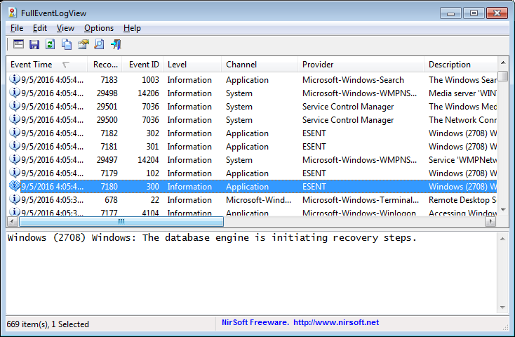

# Windows Log
#defensive #windows
Event ID yang ingin kamu lihat:
4103 & 4104: PowerShell execution / script block logging

## Windows PowerShell Transcription
#powershell
https://tryhackme.com/room/adventofcyber3 hari ke-8

Untuk menangkap perintah dan output dari PowerShell. Transcription dapat digunakan sebagai sumber saat melakukan incident response.

Untuk menyakalan transcription:
```ps1
reg add HKEY_LOCAL_MACHINE\Software\Policies\Microsoft\Windows\PowerShell\Transcription /v EnableTranscripting /t REG_DWORD /d 0x1 /f

reg add HKEY_LOCAL_MACHINE\Software\Policies\Microsoft\Windows\PowerShell\Transcription /v OutputDirectory /t REG_SZ /d C:/ /f

reg add HKEY_LOCAL_MACHINE\Software\Policies\Microsoft\Windows\PowerShell\Transcription /v EnableInvocationHeader /t REG_DWORD /d 0x1 /f
```


## Full Event Log View
https://www.nirsoft.net/utils/full_event_log_view.html
https://tryhackme.com/room/adventofcyber3 hari ke-23



Tips: 
- Advanced search
- Event ID 4103 & 4104: PowerShell execution / script block logging
- Klik kanan pada event > properties

