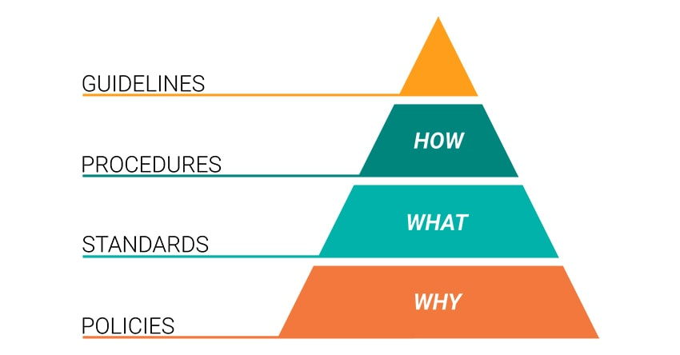

# Membuat Security Policy

Program dalam information security untuk mengkomunikasikan dalam bahasa yang jelas berkaitan dengan ekspektasi organisasi terhadap program security. Tujuannya secara umum ada dua:
- Mengurangi risiko yang terkandung di dalam implementasi sistem informasi.
- Kewajiban organisasi terhadap regulasi yang lebih besar, contoh GDPR (General Data Protection Regulation Act) di Eropa.

Namun security policy sering dilihat sebagai to-do list, sehingga sebatas checkbox, bukan kewajiban yang harus dikelola secara terus menerus. Padahal risiko siber terhadap aset-aset critical perusahaan bersifat dinamis. Oleh karena itu, sangat disarankan untuk menggunakan framework seperti ISO/IEC 27001.

## Apa itu Policy, Standard, Procedure, dan Guidelines?

Sebelum melangkah lebih lanjut, kita mungkin ingin memahami perbedaan tentang Policy, Standard, Procedure, dan Guidelines. Secara umum, perbedaan policy, standard, procedure, dan guidelines terletak pada tujuan dan lingkup implementasi pada organisasi. Policy lebih bersifat umum untuk membantu organisasi mengikuti regulasi yang lebih tinggi, sedangkan guidelines bersifat employee-centric untuk membantu karyawan dalam mengikuti policy yang berlaku pada organisasi dengan bahasa atau bahkan ilustrasi yang mudah dipahami. Berikut detail dari istilah-istilah tersebut.

Policy adalah pernyataan formal tertulis yang dibuat dan dikelola oleh eksekutif atau manajemen senior dan merupakan jangkar dari keamanan informasi organisasi. Pembuatan security policy harus sesuai dengan tujuan dari keamanan informasi pada organisasi. Jadi,  security policy yang sudah dibuat oleh satu organisasi tidak akan seluruhnya kompatibel dengan proses bisnis pada organisasi lain. Sehingga, proses pengembangan mandiri terhadap policy wajib untuk dilakukan.

Standard adalah detail teknis untuk mendukung implementasi dari security policy. Standard ini bersifat wajib dilakukan untuk konsistensi dari dan keselarasan organisasi terhadap security policy yang sudah diimplementasikan.  

Procedure adalah instruksi detail step-by-step untuk memenuhi policy atau standard yang telah diterapkan. Procedure dikelola oleh divisi-divisi  kecil untuk membantu teknis pelaksanaan dari policy dan standard. Berbeda dengan policy dan standard, procedure dapat dibuat sesuai kebutuhan waktu. Contoh: prosedur menginstall sistem operasi, proses melakukan backup, dan proses onboarding serta offboarding karyawan.

Guidelines adalah tips yang dapat diberikan kepada user apabila terdapat standard yang tidak dapat dilakukan. Guidelines berfokus pada kemudahan pembacaan dan fleksibilitas implementasi. Bahkan, apabila terdapat poin yang tidak dijelaskan secara detail atau belum tercover oleh policy, guidelines dapat membantu karyawan dalam melakukan day-to-day jobnya.

## Membuat Security Policy yang Efektif
Sebelum preses pembuatan, ada beberapa poin yang harus diselaraskan dengan security policy yang dibuat. 

Regulasi merupakan peraturan yang lebih tinggi, terutama apabila organisasi yang dikelola berada pada lokasi atau area tertentu. Regulasi dapat membantu menentukan area risiko yang akan dibahas pada security policy dan juga sejauh mana risiko keamanan siber dapat diterima secara hukum. Sebagai contoh, apabila organisasi beroperasi juga di Eropa, maka harus mengikuti aturan GDPR, apabila bergerak pada bidang kesehatan atau mengelola data pasien terdapat regulasi HIPAA, atau jika mengelola pembayaran secara digital terdapat regulasi PCI.

Selain regulasi, framework juga merupakan elemen yang penting dan bersifat umum untuk membuat security policy yang efektif. Framework menyediakan best practice untuk menentukan area akan dikontrol oleh security policy. Karena framework dibuat secara umum untuk diimplementasikan oleh banyak organisasi, terkadang poin-poin kontrol yang ada pada framework kurang relevan dengan proses bisnis dari organisasi. Contoh dari framework yang dapat membantu pembentukan security policy adalah ISO dan NIST.

Stakeholder

Subject Matter Expert
## Format Security Policy

## Referensi
1. [Security Policies, Standards, Procedures, and Guidelines](https://www.google.com/search?q=fr+secure+policies+standards+procedures+and+guidelines&oq=fr+secure+policies+standards+procedures+and+guidelines&aqs=chrome..69i57j33i10i160l2j33i22i29i30l2.16623j0j7&sourceid=chrome&ie=UTF-8)
2. [Back to Basics: How to Create Effective Information Security Policies](https://www.youtube.com/watch?v=XLdasRhVO6A&t=1504s)
3. [Contoh template security policy dari SANS Institute](https://www.sans.org/information-security-policy/)
4. 
