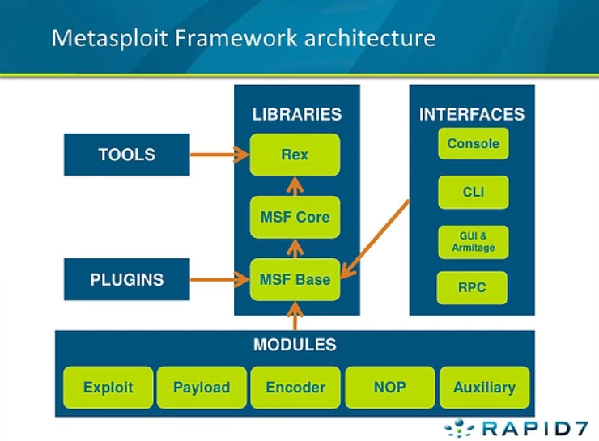

# Metasploit
type: #offensive 
techniques: #metasploit
target: #general

## Teori
Arsitektur dari metasploit


Masing-masing modul tersebut terbagi dalam foldernya masing-masing
- Auxillary: modul yang dipakai untuk scanning, enumerasi, dan fingerprinting.
- Exploit: modul yang berisi code untuk eksploitasi.
- Payload: modul yang berisi berbagai macam shellcode yang dieksekusi setelah eksploitasi. Contoh: Meterpreter, Reverse TCP, dll
- Post: walaupun tidak terdaftar pada gambar di atas, modul ini digunakan untuk post-exploitation, contohnya looting dan pivoting.
- Encoder: modul untuk mengubah "penampilan" dari kode exploit, untuk bypass signature detection.
- NOP: modul untuk melakukan buffer overflow dan serangan ROP (Return-Oriented Programming)

Apabila ingin menggunakan modul lain, kamu bisa gunakan perintah `load`.

## Koneksi ke Database
Koneksi ke database sifatnya opsional, namun dengan ini, kamu dapat menyimpan progress pada workspace dan melakukan `db_nmap`.
```sh
# jalankan postgresql pada sistem
sudo systemctl start postgresql

# inisiasi database
sudo msfdb init

# jalankan metasploit
sudo msfconsole

# cek status database
db_status
```

Menyiapkan workspace
```sh
# list workspace
workspace

# menambahkan workspace
workspace -a <nama_workspace>

# menggunakan workspace
workspace <nama_workspace>

# get help
workspace -h
```

## General
Sebelum eksekusi
```sh
# get Help
msfconsole -h

# eksekusi
msfconsole
```

Sesudah eksekusi dan gambar alay
```sh
# cek status database
db_status

# get help
help
?

# search modul
search <keyword>

# menggunakan modul setelah search
use <nomor>
```

Konfigurasi modul
```sh
# set value
set RHOSTS <value>

# set global variable, apabila fokus ke 1 mesin
setg RHOSTS <value>

# undo set
unset RHOSTS

# melihat variabel yang belum diset
options

# informasi penting
info
```


## Melihat Isi Database
```sh
# daftar hosts
hosts
hosts -h

# daftar service
services
services -h

# service memiliki banyak kolom, apabila ingin melihat kolom nama, info pada target ip.
services -c name,info <target_ip>

# service pada port tertentu
services -p 80-443

# temukan keyword pada service
services -S <keyword>

# export hasil
services -o /save/location

# daftar credentials
creds
```

Export & import db
```sh
# export & backup
db_export -h
db_export -f xml /location/

# import
db_import /location/
```

## Amazing Resources
[RECON2-NmapMetasploit](RECON2-NmapMetasploit.md)
[SHELL2-Meterpreter](SHELL2-Meterpreter.md)
https://tryhackme.com/room/rpmetasploit