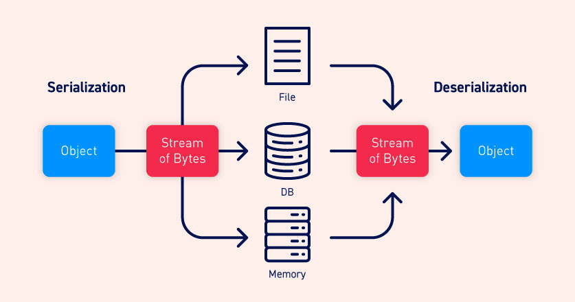

# Insecure Deserialization
type: #offensive #deserialization #definition

## Serialization
Meng-convert struktur data kompleks seperti objects dan fields menjadi format yang lebih flat sehingga dapat dikirim dan diterima sebagai byte stream yang urut. Kegunaan dari serialization:
- Menuliskan data kompleks untuk berinteraksi antar proses pada memori, file, ataupun database.
- Mengirimkan data kompleks melalui jaringan atau API call

## Deserialization
Mengembalikan byte stream menjadi bentuk fungsional atau menjadi bentuk original. Bentuk yang sudah di-deserialization ini lah yang dapat berinteraksi dengan sistem.

## Diagram

## Insecure Deserialization
Apabila terdapat user-controllable data yang berhasi di-deserialized oleh website. Hal ini memperbolehkan penyerang untuk memanipulasi objek dan mengirimkan data berbahaya kepada application code. Insecure dserialization terkadang disebut sebagai "object interaction" vulnerability. 

Idealnya, user input tidak boleh di-deserialized sama sekali.

Banyak provider yang menerapkan filtering pada data yang sudah di-deserialized, namun ini kurang efektif, karena:
- Tidak mungkin seluruh event di-filter, validasi, dan sanitasi.
- Banyak deserialization attack yang berhasil sebelum proses deserialization-nya sendiri selesai.

Deserialization vulnerability juga merupakan dampak negatif dari besarnya jumlah dependancies (plugin, library, dll) pada web, sehingga proses pengamanan secara detail terhadap class dan methodnya juga semakin sulit.

Dampak dari insecure deserialization:
- Remote code execution
- Denial-of-service
- Privilege escalation
- Data exfiltration

## Mencegah
- Deserialization terhadap user input sebaiknya tidak boleh terjadi.
- Cek integritas data apabila deserialization berasal dari untrusted source.
- Proses filtering dan integrity checking seharusnya dilakukan sebelum proses deserialization dimulai.
- Membuat class untuk serialization dan deserialization sendiri agar dapat mengontrol bagian field mana saja yang boleh diekspos.

## Referensi
https://portswigger.net/web-security/deserialization

